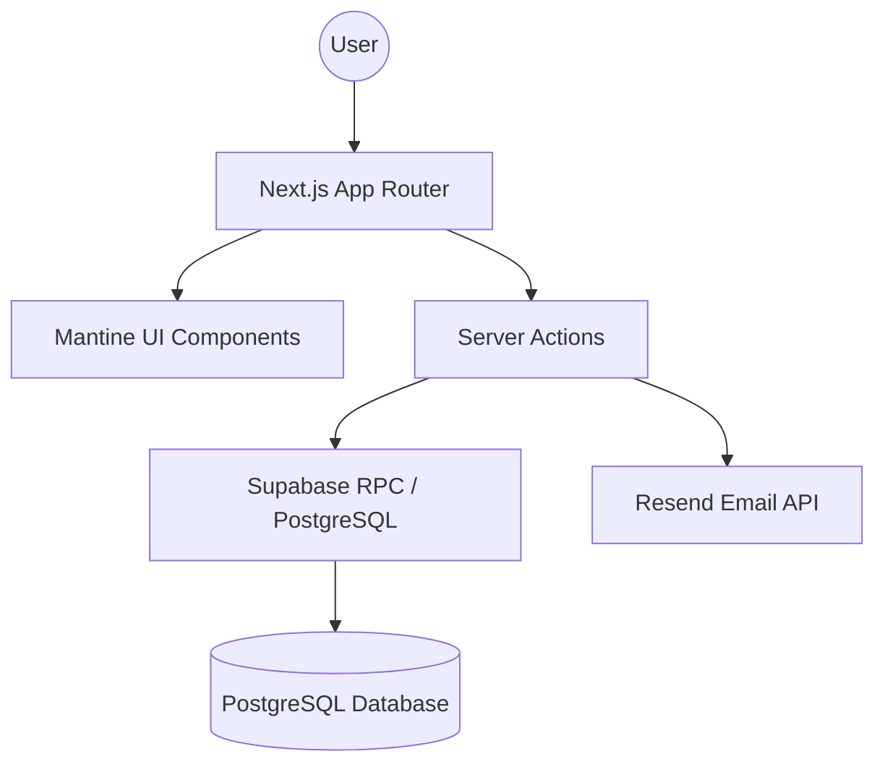

# 📋 Contract Expiry Management System

A sophisticated, centralized platform designed for tracking, managing, and automating employee contract renewals. Built to streamline HR operations and eliminate the risk of silent contract expirations.

---

## 🚀 Getting Started

### 1. Prerequisites
- **Node.js** (v20 or higher)
- **Docker** (Required for local Supabase environment)
- **NPM** or **Yarn**

### 2. Installation
```bash
# Clone the repository
git clone https://github.com/Rej327/contract-expiry-management.git
cd contract-expiry-management

# Install dependencies
npm install
```

### 3. Database Setup (Supabase Local)
Ensure Docker is running, then initialize the local database:
```bash
# Start Supabase services
npx supabase start

# Apply migrations and seed data
npx supabase db reset
```
*Note: After starting, copy the `API URL`, `anon key`, and `service_role key` from the terminal output to your `.env.local` file.*

### 4. Environment Configuration
Create a `.env.local` file in the root directory:
```env
NEXT_PUBLIC_SUPABASE_URL=your_supabase_url
NEXT_PUBLIC_SUPABASE_ANON_KEY=your_supabase_anon_key
SUPABASE_SERVICE_ROLE_KEY=your_service_role_key
RESEND_API_KEY=your_resend_api_key
```

### 5. Run Development Server
```bash
npm run dev
```
Navigate to [http://localhost:3000](http://localhost:3000) to explore the application.

---

## ✨ Key Features

### 📊 Intelligent Dashboard
- **Real-time Stats**: Instant visibility into total, expiring, and expired contracts.
- **Urgency Tracking**: Focused "Expiring Soon" widget with color-coded priority levels (Critical vs. Warning).
- **Activity Streams**: Audit trail of recent system actions and contract updates.

### 📝 Contract Lifecycle Management
- **Centralized Registry**: Unified view of all employee contracts with advanced filtering and search.
- **Detailed Profiles**: Deep dive into individual contract terms, employee data, and history.
- **Smart CRUD**: Simplified creation and modification of contract records with automated internal validation.

### 🔄 Renewal Workflows
- **Dedicated Renewal Hub**: Specialized view for managing contracts currently in the renewal pipeline.
- **Status Monitoring**: Track renewals through various stages from notification to completion.

### 📈 Analytical Reporting
- **Data Visualization**: Visual representations of contract distribution and expiry trends.
- **Exportable Insights**: Ready-to-use reports for HR planning and budget forecasting.

### ✉️ Automated Notifications
- **Email Alerts**: Integration with **Resend** for automated expiry notifications.
- **System Notifications**: In-app feedback for all user actions powered by Mantine.

---

## 🏗 Architecture & Tech Stack

### High-Level Architecture
The system follows a modern **Serverless/Hybrid** architecture using Next.js 16 and Supabase.



### Technical Stack
- **Frontend Framework**: [Next.js 16 (App Router)](https://nextjs.org/)
- **UI Library**: [Mantine v9](https://mantine.dev/) + [Mantine DataTable](https://ic7610.github.io/mantine-datatable/)
- **Styling**: [Tailwind CSS 4](https://tailwindcss.com/)
- **Backend & Database**: [Supabase](https://supabase.com/) (PostgreSQL + Auth)
- **Database Logic**: Extensive use of **PostgreSQL RPCs** for high-performance data operations.
- **Email Service**: [Resend](https://resend.com/)
- **Testing SDK**: [Jest](https://jestjs.io/) (Unit) & [Playwright](https://playwright.dev/) (E2E)
- **Date Handling**: [Day.js](https://day.js.org/)

---

## 🧪 Testing

### Unit & Integration Tests
Mainly focused on logic and component rendering.
```bash
npm run test
```

### End-to-End Tests
Browser-based testing using Playwright.
```bash
npm run test:e2e
```

---

## 📂 Project Structure

- `app/`: Next.js App Router (pages and server actions).
- `components/`: Modular UI components organized by feature.
- `lib/`: Shared utility functions and service clients (Supabase, Resend).
- `supabase/`: Local database configuration, migrations, and seed scripts.
- `types/`: Universal TypeScript definitions.
- `tests/`: Comprehensive test suites.

---

Developed for the **Formsly Feature Proposal** by **Jefferson Resurreccion**.
